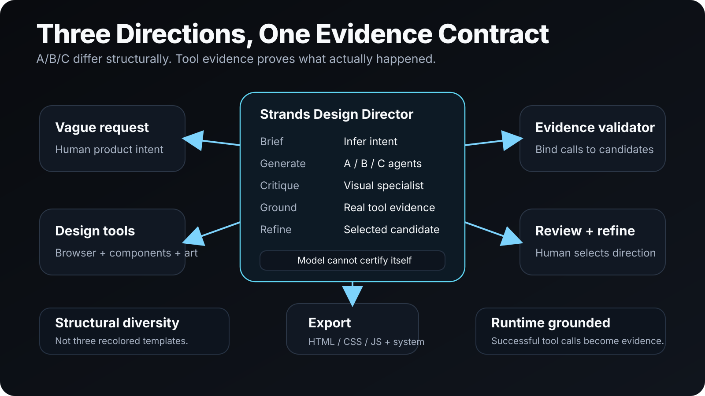
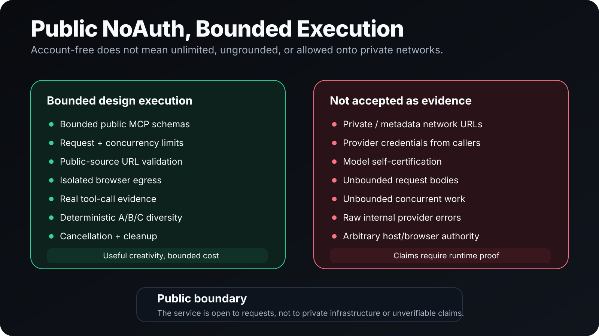

# Web Design Agent

**Turn a vague design request into three real, structurally different websites that a human can review, tune, and refine.**

Web Design Agent is a Strands-powered design product that turns ambiguous product intent into real A/B/C website implementations, grounds them in browser/provider evidence, lets a human compare and visually tune the candidates, and refines the selected direction into exportable HTML/CSS/JS plus reusable design-system evidence.

[Hackathon submission](HACKATHON_SUBMISSION.md) · [Demo runbook](DEMO_RUNBOOK.md) · [Architecture](docs/ARCHITECTURE.svg) · [Safety boundary](docs/SAFETY_BOUNDARY.svg) · [Source](https://github.com/tjXJNOOBIE/Web-Design-Agent)



## Why Web Design Agent

Design tools usually fail in one of two ways: they produce a single polished guess too early, or they generate multiple options that are really the same layout wearing different colors.

Web Design Agent makes divergence part of the product contract. It builds three structurally different candidates, records the design decisions that make them different, checks pairwise design distance, and keeps the human in the selection loop before refinement.

```text
vague request
  -> infer product brief
  -> build structurally different A / B / C
  -> inspect available browser/provider evidence
  -> compare and tune candidates
  -> select one direction
  -> refine selected candidate
  -> export real HTML/CSS/JS + design-system evidence
```

## What it does

Web Design Agent exposes the same workflow through several surfaces:

- public stateless NoAuth HTTP MCP at `/mcp`;
- stdio MCP for local clients;
- MCP App A/B/C review and tuning UI;
- `web-design-agent` CLI generation;
- `web-design-agent-eval` one-shot vague-prompt evaluation.

Clients do not create WDA accounts or provide WDA-owned credentials. Model, browser, component, and image-provider credentials remain deployment-owned capabilities behind the service boundary.

## A/B/C by contract

A/B/C candidates must differ structurally, not merely cosmetically.

Every candidate carries a **Design Genome** describing:

- composition;
- navigation;
- hero strategy;
- typography;
- density;
- geometry;
- surface model;
- depth;
- motion;
- content rhythm;
- imagery strategy.

`DesignDistanceEvaluator` scores every pair. One full regeneration is allowed after deterministic diversity failure; a second insufficiently diverse set is rejected.

Each accepted candidate can include real HTML/CSS/JavaScript, multiple routes, a reusable design system, live visual-state defaults, critique notes, and grounded runtime evidence.

## Strands architecture

Strands owns the agent/model/tool loop. Web Design Agent consumes that runtime through the shared `@tjxjnoobie/strands-bridge` integration package.

```text
MCP / CLI request
  -> WebDesignAgentWorkflowHandler
  -> WebDesignAgentRuntimeBuilder
     -> Candidate A native Strands agent
     -> Candidate B native Strands agent
     -> Candidate C native Strands agent
     -> Visual Critic native Strands agent
     -> optional Concept Artist native Strands agent
     -> Design Director native Strands agent
          with specialists exposed as native agent tools
  -> deterministic validation + runtime evidence
  -> typed result
  -> reverse-order lifecycle close
```

The Director coordinates specialists; the product runtime owns schemas, diversity gates, evidence binding, cancellation, and cleanup.

## Runtime-grounded evidence

Web Design Agent does not trust model-authored claims that a tool was used successfully.

Generation and refinement consume the native Strands event stream. `WebDesignAgentToolEvidenceCollector` records successful nested specialist calls and binds them to the candidate that actually used them.

### Browser evidence

A successful `browser_navigate` establishes the inspected target. A later failed navigation clears it. `browser_snapshot` or `browser_take_screenshot` counts only when bound to a successful navigation target.

- model-authored `browserValidated` is ignored;
- model-authored browser evidence is replaced by runtime evidence;
- failed browser calls do not count;
- source/reference-driven generation requires A/B/C to inspect the validated source target;
- unrelated screenshots cannot validate the returned website.

### Component and concept evidence

Successful `components_*` calls are attributed to the candidate that used component research.

Concept-first generation requires a successful Concept Artist `assets_*` provider call. Model-authored image URLs without provider execution are not accepted as evidence.

## MCP App review

The MCP App is the human selection and refinement surface. It supports:

- A/B/C switching and simultaneous comparison;
- desktop, tablet, and mobile preview widths;
- multi-page route switching;
- density, spacing, radius, font, hero, contrast, depth, and motion controls;
- immediate local visual changes without a model round trip;
- selected-candidate refinement;
- design-system inspection;
- context handoff;
- standalone export;
- concept-first selection.

## NoAuth, bounded by design

The public MCP endpoint is account-free, not authority-free.



Explicit browserable source URLs are validated before Strands sees them:

- HTTP(S) only;
- no URL credentials;
- public browser ports only;
- localhost/internal names rejected;
- DNS resolved before use;
- private, loopback, link-local, metadata, reserved, multicast, or mixed public/private results rejected.

Public deployment with browser capability must also enforce real egress isolation from Tavall/control/private/metadata networks and explicitly declare that boundary with:

```text
WEB_DESIGN_AGENT_PUBLIC_BROWSER_EGRESS_ISOLATED=true
```

The declaration is a startup invariant, not a substitute for network isolation.

## Resource controls

Public requests are bounded before expensive workflow execution.

| Environment variable | Default | Meaning |
| --- | ---: | --- |
| `WEB_DESIGN_AGENT_MAX_CONCURRENT_REQUESTS` | `4` | In-flight `/mcp` requests per process. |
| `WEB_DESIGN_AGENT_MAX_REQUEST_BODY_BYTES` | `1048576` | Maximum JSON request body. |
| `WEB_DESIGN_AGENT_REQUEST_RECEIVE_TIMEOUT_MS` | `30000` | Request-body receive timeout. |
| `WEB_DESIGN_AGENT_HEADERS_TIMEOUT_MS` | `15000` | Header receive timeout. |
| `WEB_DESIGN_AGENT_MAX_TURNS` | `16` | Native Strands turn limit. |
| `WEB_DESIGN_AGENT_MAX_OUTPUT_TOKENS` | `60000` | Output-token ceiling. |
| `WEB_DESIGN_AGENT_MAX_TOTAL_TOKENS` | `200000` | Total invocation token ceiling. |

Caller cancellation propagates into the Strands invocation. Global/per-source throttling remains an edge/deployment responsibility.

## Optional design capabilities

External providers are role-scoped and optional.

| Capability | Configuration | Behavior |
| --- | --- | --- |
| 21st component research | `API_KEY_21ST` | Candidate-only component/design research. |
| Deployment browser MCP | `WEB_DESIGN_AGENT_BROWSER_MCP_URL` | Preferred browser path when configured. |
| Local Playwright MCP | `WEB_DESIGN_AGENT_ENABLE_PLAYWRIGHT=true` | Headless/isolated browser tool surface. |
| Browser executable | `WEB_DESIGN_AGENT_PLAYWRIGHT_EXECUTABLE_PATH` | Reuse an environment-installed browser. |
| Higgsfield concept-first | `WEB_DESIGN_AGENT_ENABLE_HIGGSFIELD=true` | Concept Artist image-provider capability. |

Candidate agents receive component/browser capability. The Director receives specialist agent tools. The Critic does not create duplicate browser/component runtimes. The Concept Artist receives image capability only.

## Install and run

### Requirements

- Node.js
- an authorized model surface for real generation
- optional browser/component/image providers depending on the flow being tested

Clone and validate:

```bash
git clone https://github.com/tjXJNOOBIE/Web-Design-Agent.git
cd Web-Design-Agent
npm install
npm run check:real
```

Run HTTP MCP:

```bash
node dist/mcp/main.js
```

Run stdio MCP:

```bash
node dist/mcp/main.js --stdio
```

Run the CLI:

```bash
node dist/cli/main.js "make a competitive Minecraft PvP website"
```

For local developer testing with a ChatGPT subscription, the shared bridge can use a locally authenticated Codex CLI model surface while native Strands still owns the tool loop.

## Validate the release

Core gate:

```bash
npm run check:real
```

Durable development gate with an environment-owned browser:

```bash
WEB_DESIGN_AGENT_PLAYWRIGHT_EXECUTABLE_PATH=/path/to/chrome \
npm run check:durable
```

The repository keeps deterministic product validation, packed-consumer startup, HTTP MCP discovery, browser-tool evidence, and durable/provider acceptance as separate evidence classes. The exact current promotion status and remaining gates live in the demo/submission documentation rather than hard-coded commit hashes in the landing page.

## Hackathon evidence

- [`HACKATHON_SUBMISSION.md`](HACKATHON_SUBMISSION.md) contains the hackathon framing and pre-existing-component disclosure.
- [`DEMO_RUNBOOK.md`](DEMO_RUNBOOK.md) contains the exact demo and acceptance path.
- [`docs/ARCHITECTURE.svg`](docs/ARCHITECTURE.svg) shows the Director, specialists, deterministic runtime, and provider boundaries.
- [`docs/SAFETY_BOUNDARY.svg`](docs/SAFETY_BOUNDARY.svg) shows the public NoAuth and browser/network authority boundary.
- Runtime evidence is collected from real tool events instead of accepting model-authored validation claims.

The project is released under the [MIT License](LICENSE).
